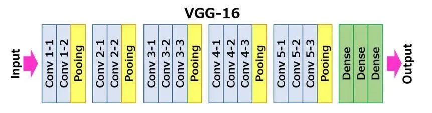
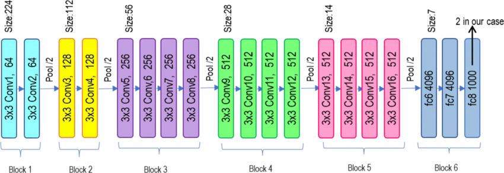

# VGGNet-MNIST

This repository contains a PyTorch implementation of various VGGNet architectures (VGG11, VGG13, VGG16, VGG19) from scratch. It includes a script for training and testing the model on the MNIST dataset.


*VGG16 Architecture*


*VGG19 Architecture*

## Table of Contents

- [Introduction](#introduction)
- [Installation](#installation)
- [Usage](#usage)
- [Model Architectures](#model-architectures)
- [Results](#results)
- [Contributing](#contributing)

## Introduction

VGGNet is a convolutional neural network architecture proposed by the Visual Geometry Group (VGG) from Oxford University. It is known for its simplicity and uniform architecture, using small convolutional filters and deep layers. This repository implements VGGNet from scratch using PyTorch and applies it to the MNIST dataset.

## Installation

To get started, clone the repository and navigate to its directory

```bash
git clone https://github.com/matin-ghorbani/VGGNet-PyTorch.git
cd VGGNet-PyTorch
```

Then install the necessary dependencies:

```bash
pip install -r requirements.
```

## Usage

Run the following command

```bash
python main.py
```

## Model Architectures

The following VGG architectures are implemented in this repository:

- VGG11
- VGG13
- VGG16
- VGG19

You can choose which architecture to use by modifying the `arch` parameter in the script.

## Results

- Loss of the model on the train images: `0.0099`
- Accuracy of the model on the test images: `92.96%`

## Contributing

Contributions are welcome! If you have any improvements, feel free to open a pull request.
